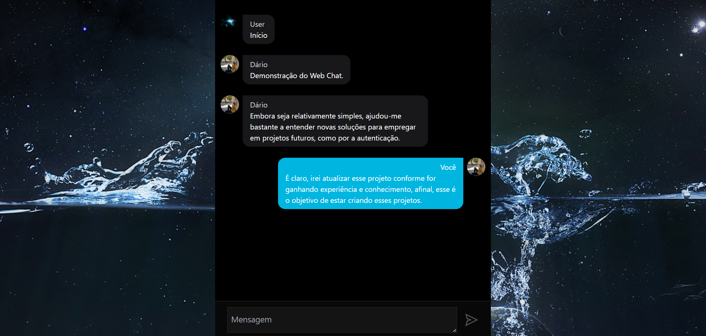
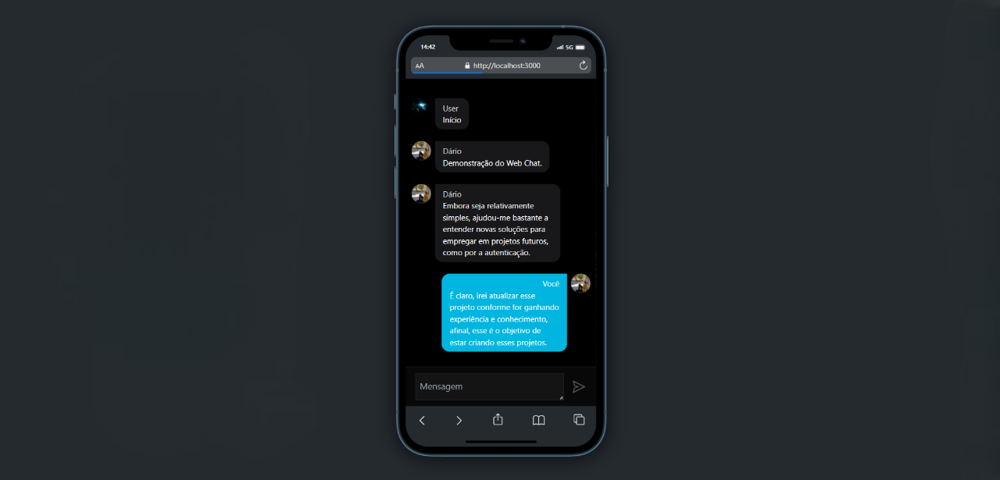

# Lista de tarefas

  
  

## Projeto

### O que irá encontrar:

<ul>
  <li>
    Tela para criar uma conta, seja por meio do Google ou inserindo o seu nome, email e senha;
  </li>
  <li>
    Tela para fazer login em sua conta;
  </li>
  <li>
    Chat em tempo real, com a sua foto de perfil e nome de usuário.
  </li>
</ul>

## Link de acesso
Veja esse projeto em execução: [demo](https://webchat-dariomatias-dev.vercel.app/).

## Screenshots
<h3>Desktop</h3>

<h3>Mobile</h3>

## 🛠 Tecnologias

As seguintes ferramentas foram usadas na construção desse projeto:

- [TypeScript](https://www.typescriptlang.org/)
- [Next.js](https://nextjs.org/)
- [TailwindCSS](https://tailwindcss.com/)
- [SASS](https://sass-lang.com/)
- [Firebase](https://firebase.google.com/?hl=pt)

 

## Autor

  <b>Dário Matias</b>

 
  Entre em contato!
 
 

